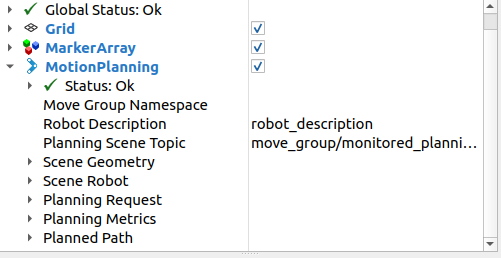
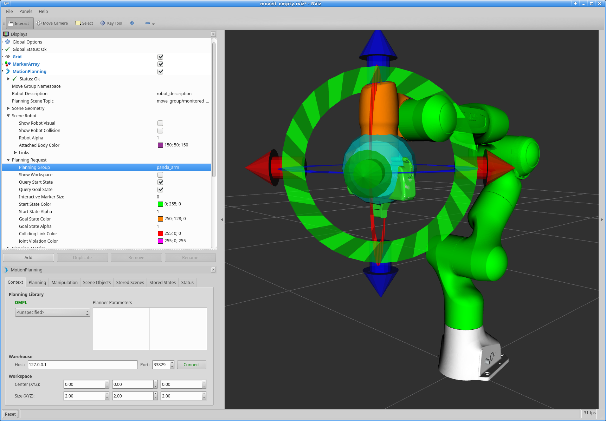
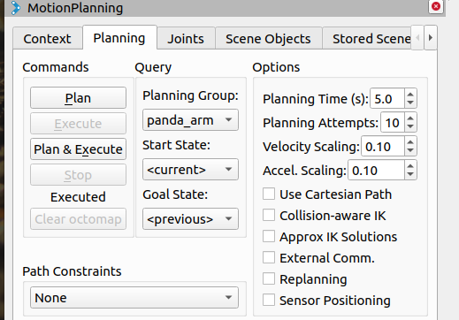
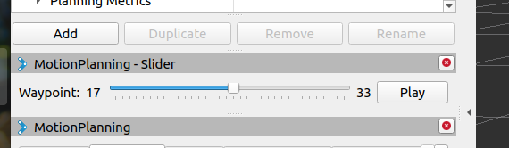
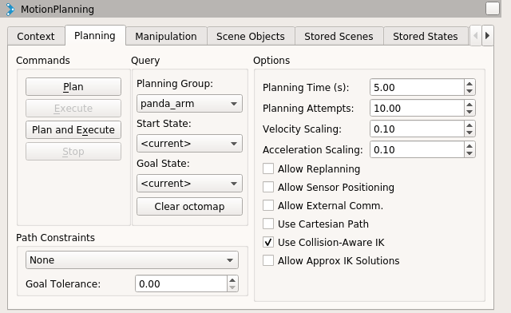
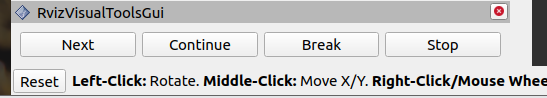

# 记录按照moveit noetic教程学习的过程

## rviz过程

通过rviz的插件引入**MotionPlanning**插件。

可以发现有图中的很多的设置对象。对图中的设置解释一下：

1. 设置坐标系 Global Options中设置fixed_frame为我们机器人的基坐标系。
2. （以下为对MotionPlanning中的设置）设置机器人订阅话题 robot_description
3. 设置运动规划场景 planning scene topic
4. 设置轨迹话题 trajectory topic
5. 设置规划请求 planning request设置规划组Planning Group

### 对机器人的可视化演示


1. 在scense robot中选择是否展示机器人的场景状态 show robot visual
2. 在planned path中选择是否展示机器人show robot visual（白色实体机器人）
3. 在planning request中选择是否展示起始结束状态 Query start\goal state（绿色为起始状态、橙色为目标状态）

在joints部分可以保持末端不变而改变关节空间参数，实现零空间探索。那么什么时零空间探索呢，“Null Space Exploration”（零空间探索）是机器人运动规划和控制中一个非常核心且高级的概念，主要用于冗余机器人。在保持机器人末端执行器（手/夹爪）位置和姿态完全不变的情况下，调整机器人内部关节的角度。



可以通过鼠标拖动来设置start\goal state，也可以通过下拉folder来选择状态，主要分为以下几种：

1. The current state
2. The previous state(前一次规划的状态)
3. A randomly sampled state
4. A named state of the selected planning group, as defined in the srdf file of the robot.(在srdf中定义的状态)

### 对规划的状态进行回顾

在panels中选择MotionPlanning-Slider，添加到rviz中。


拖动滑杆可以看到规划中的状态，点击play可以冲滑杆位置，开始演示路径执行的过程。


### 设置速度、加速度


默认速度、加速度设置的为机器人最大值的10%，我们可以对这个缩放因子进行调整，或者修改我们机器人的最大速度、加速度的设置（在moveit_config中的joint_limit.yaml）

### 规划过程的分步执行

主要借助于moveit_visual_tools工具，在panels中选择RvizVisualToolsGui，将插件加入到rviz中。

## C++接口

最简单的用户接口是通MoveGroupInterface class，**It provides easy to use functionality for most operations** that a user may want to carry out, specifically setting **joint or pose goals**, **creating motion plans**, **moving the robot**, **adding objects** into the environment and **attaching/detaching objects** from the robot.  This interface communicates over ROS topics, services, and actions to the MoveGroup Node.

就是通过该类(MoveGropInterface), 可以设置关节空间或者是笛卡尔空间的状态，可以求解相应的路径规划解，可以发布移动机器人的指令，可以添加障碍物，也可以添加附着物。
当然这只是一个接口的类，具体的这些功能的实现主要还是靠MoveGroup来实现，这个类主要是借助于话题、服务以及动作，向MoveGroup发送相应的请求。

```shell
# 执行以下两条指令
roslaunch panda_moveit_config demo.launch
roslaunch moveit_tutorials move_group_interface_tutorial.launch
```

先设置运动规划组planning groups/joint model group：
通过`moveit::planning_interface::MoveGroupInterface`设置接口对象，输入为规划组的名称，例如"aubo_i5"、"panda_arm"等
通过`moveit::planning_interface::PlanningSceneInterface`设置规划场景的对象
通过原始指针指向规划组的接口对象提升运行效率。
`const moveit::core::JointModelGroup* joint_model_group = move_group_interface.getCurrentState()->getJointModelGroup(PLANNING_GROUP);`

可视化设置：
通常使用rviz进行可视化，这里当然使用rviz相关的接口了，先初始化一个MoveItVisualTools对象
`moveit_visual_tools::MoveItVisualTools visual_tools("panda_link0");`
这里输入参数是参考坐标系的名称，这里选择的是机器人的基坐标系

```cpp
moveit_visual_tools::MoveItVisualTools visual_tools("panda_link0");
visual_tools.deleteAllMarkers();// 清理旧标记
visual_tools.loadRemoteControl();// 加载远程控制 与rviz的GUI进行交互

// 设置一个三维矩阵来表示位置
Eigen::Isometry3d text_pose = Eigen::Isometry3d::Identity();
text_pose.translation().z() = 1.0;
// 将文字放置到rviz中 位置 文字 白色 超大
visual_tools.publishText(text_pose, "MoveGroupInterface Demo", rvt::WHITE, rvt::XLARGE);

// 将设置发布到rviz上
visual_tools.trigger();
```

运动规划演示

```cpp
// 在rviz上画一个坐标轴
visual_tools.publishAxisLabeled(target_pose1, "pose1");
// 显示文字提示
visual_tools.publishText(text_pose, "Pose Goal", rvt::WHITE, rvt::XLARGE);
// 绘制路径规划的轨迹
visual_tools.publishTrajectoryLine(my_plan.trajectory_, joint_model_group);
// 将以上的指令序列发送
visual_tools.trigger();
// 程序运行到这里会死锁 等待GUI next
visual_tools.prompt("Press 'next' in the RvizVisualToolsGui window to continue the demo");
```

### 规划相关的操作

#### **设置规划组、规划场景**
```cpp
static const std::string PLANNING_GROUP = "panda_arm";
moveit::planning_interface::MoveGroupInterface move_group_interface(PLANNING_GROUP);
moveit::planning_interface::PlanningSceneInterface planning_scene_interface;
const moveit::core::JointModelGroup* joint_model_group =
      move_group_interface.getCurrentState()->getJointModelGroup(PLANNING_GROUP);
```

**设置笛卡尔状态（位置+姿态）**
```cpp
geometry_msgs::Pose target_pose1;
target_pose1.orientation.w = 1.0;
target_pose1.position.x = 0.28;
target_pose1.position.y = -0.2;
target_pose1.position.z = 0.5;
move_group_interface.setPoseTarget(target_pose1);
```

**设置关节空间状态（一组关节角度）**
```cpp
// 该指针包含 当前位置、速度、加速度
moveit::core::RobotStatePtr current_state = move_group_interface.getCurrentState();
std::vector<double> joint_group_positions;
current_state->copyJointGroupPositions(joint_model_group, joint_group_positions);
joint_group_positions[0] = -tau / 6;  // -1/6 turn in radians
move_group_interface.setJointValueTarget(joint_group_positions);
```

**设置运动参数(设置最大速度\加速度 缩放因子)**
```cpp
move_group_interface.setMaxVelocityScalingFactor(0.05);
move_group_interface.setMaxAccelerationScalingFactor(0.05);
```

**执行**
```cpp
moveit::planning_interface::MoveGroupInterface::Plan my_plan;

bool success = (move_group_interface.plan(my_plan) == moveit::core::MoveItErrorCode::SUCCESS);

ROS_INFO_NAMED("tutorial", "Visualizing plan 1 (pose goal) %s", success ? "" : "FAILED");

// 轨迹执行（注意起始状态）
move_group_interface.execute(my_plan);
// 尝试向目标执行
move_group_interface.move();
```
**运动限制**
让机器人执行路径约束规划之前需要先指定路径约束和目标状态，下面就是定义的路径约束。
```cpp
moveit_msgs::OrientationConstraint ocm;
// 约束link 相对于那个坐标系
ocm.link_name = "panda_link7";
ocm.header.frame_id = "panda_link0";
ocm.orientation.w = 1.0;
// 定义每个轴允许晃动的角度误差范围
ocm.absolute_x_axis_tolerance = 0.1;
ocm.absolute_y_axis_tolerance = 0.1;
ocm.absolute_z_axis_tolerance = 0.1;
ocm.weight = 1.0;// 约束权重

moveit_msgs::Constraints test_constraints;
test_constraints.orientation_constraints.push_back(ocm);
move_group_interface.setPathConstraints(test_constraints);
```

**从预设状态开始规划**
```cpp
// 存储起始状态（关节、笛卡尔）
moveit::core::RobotState start_state(*move_group_interface.getCurrentState());
geometry_msgs::Pose start_pose2;
start_pose2.orientation.w = 1.0;
start_pose2.position.x = 0.55;
start_pose2.position.y = -0.05;
start_pose2.position.z = 0.8;
// 运动学逆解 将笛卡尔空间的坐标转化为关节空间中的状态存储在start_state中
start_state.setFromIK(joint_model_group, start_pose2);
move_group_interface.setStartState(start_state);// 设置起始状态
move_group_interface.setPoseTarget(target_pose1);// 设置目标状态
move_group_interface.setPlanningTime(10.0);// 规划时间增长
```

**笛卡尔路径规划**
指定笛卡尔路径点（一个列表，存储则末端执行器经过的点）
需要注意的是笛卡尔运动相对于普通的关节规划，`move_group.setMaxVelocityScalingFactor(0.1);`，也就是我们无法通过这些函数限制速度加速度。原因在于computeCartesianPath 这是一个纯几何的计算，它生成的只是一串密集的空间坐标点（Waypoints），默认并没有包含“什么时间到达哪个点”的信息。也就是生成的路径一开始是没有“速度”概念的。所以我们需要手动给这条几何路径加上时间戳，也就是Trajectory Parameterization（轨迹参数化）。
```cpp
std::vector<geometry_msgs::Pose> waypoints;
waypoints.push_back(start_pose2);

geometry_msgs::Pose target_pose3 = start_pose2;

target_pose3.position.z -= 0.2;
waypoints.push_back(target_pose3);  // down

target_pose3.position.y -= 0.2;
waypoints.push_back(target_pose3);  // right

target_pose3.position.z += 0.2;
target_pose3.position.y += 0.2;
target_pose3.position.x -= 0.2;
waypoints.push_back(target_pose3);  // up and left

moveit_msgs::RobotTrajectory trajectory;
const double eef_step = 0.01;
double fraction = move_group_interface.computeCartesianPath(waypoints, eef_step, trajectory);
ROS_INFO_NAMED("tutorial", "Visualizing plan 4 (Cartesian path) (%.2f%% achieved)", fraction * 100.0);

move_group_interface.execute(trajectory);
```

这里除了展示文字、规划轨迹、坐标轴还有路径
```cpp
visual_tools.deleteAllMarkers();
visual_tools.publishText(text_pose, "Cartesian Path", rvt::WHITE, rvt::XLARGE);
visual_tools.publishTrajectoryLine(trajectory, joint_model_group);
visual_tools.publishPath(waypoints, rvt::LIME_GREEN, rvt::SMALL);
for (std::size_t i = 0; i < waypoints.size(); ++i)
  visual_tools.publishAxisLabeled(waypoints[i], "pt" + std::to_string(i), rvt::SMALL);
visual_tools.trigger();
```
```cpp
// 对笛卡尔路径进行修改
// 先生成几何路径（这一步只得到了一串点，还没有速度信息）
moveit_msgs::RobotTrajectory trajectory;
double fraction = move_group.computeCartesianPath(waypoints, eef_step, jump_threshold, trajectory);

// 2. 创建一个 RobotTrajectory 对象来处理数据
robot_trajectory::RobotTrajectory rt(move_group.getCurrentState()->getRobotModel(), "manipulator");
rt.setRobotTrajectoryMsg(*move_group.getCurrentState(), trajectory);

// 引入时间参数化算法
trajectory_processing::IterativeParabolicTimeParameterization iptp;

// 设置你想要的速度和加速度比例 
// 比如：速度 0.1 (10%), 加速度 0.1 (10%)
bool success = iptp.computeTimeStamps(rt, 0.1, 0.1);

// 4. 将处理好（带时间戳）的轨迹放回 plan 中
rt.getRobotTrajectoryMsg(trajectory);
my_plan.trajectory_ = trajectory;

// 5. 执行
move_group.execute(my_plan);
```

**添加障碍物到规划场景**
定义障碍物信息，主要用到以下几个数据类型：第一个是`moveit_msgs::CollisionObject`定义的是障碍物的信息，包括**参考坐标系**(header.frame_id)、**名称**(id)、**形状**(primitives)、**位姿**(primitive_poses)、**操作类型**(operation )等。形状使用的数据类型是`shape_msgs::SolidPrimitive `，主要包括类型（type）、参数（dimensions）。位姿使用的数据类型是`geometry_msgs::Pose`
```cpp
moveit_msgs::CollisionObject collision_object;
collision_object.header.frame_id = move_group_interface.getPlanningFrame();
collision_object.id = "box1"; //名称

shape_msgs::SolidPrimitive primitive;
primitive.type = primitive.BOX;
primitive.dimensions.resize(3);
primitive.dimensions[primitive.BOX_X] = 0.1;
primitive.dimensions[primitive.BOX_Y] = 1.5;
primitive.dimensions[primitive.BOX_Z] = 0.5;

geometry_msgs::Pose box_pose;
box_pose.orientation.w = 1.0;
box_pose.position.x = 0.5;
box_pose.position.y = 0.0;
box_pose.position.z = 0.25;

collision_object.primitives.push_back(primitive);
collision_object.primitive_poses.push_back(box_pose);
collision_object.operation = collision_object.ADD;

std::vector<moveit_msgs::CollisionObject> collision_objects;
collision_objects.push_back(collision_object);

ROS_INFO_NAMED("tutorial", "Add an object into the world");
planning_scene_interface.addCollisionObjects(collision_objects);
```

**附着物路径规划**
模拟机器人抓取目标物体，携带物体进行运动规划。数据类型与障碍物相似，值得注意的是往往附着物的参考坐标系是末端执行器，当然对于眼在手外的抓取以基坐标为参考坐标系也是非常合理的。
值得注意的是`move_group_interface.attachObject(object_to_attach.id, "panda_hand", { "panda_leftfinger", "panda_rightfinger" });`：将一个原本静止的环境物体（Collision Object）“粘”在机器人身上，并允许它们之间发生接触。
该函数主要实现两种功能：

- 运动学绑定，将附着物变为机器人的一部分，跟随机器人进行路径规划，一块进行移动。
- 修改碰撞检测规则，设置可以碰撞附着物的link列表，避免报错。
 
```cpp
moveit_msgs::CollisionObject object_to_attach;
object_to_attach.id = "cylinder1";

shape_msgs::SolidPrimitive cylinder_primitive;
cylinder_primitive.type = primitive.CYLINDER;
cylinder_primitive.dimensions.resize(2);
cylinder_primitive.dimensions[primitive.CYLINDER_HEIGHT] = 0.20;
cylinder_primitive.dimensions[primitive.CYLINDER_RADIUS] = 0.04;

object_to_attach.header.frame_id = move_group_interface.getEndEffectorLink();
geometry_msgs::Pose grab_pose;
grab_pose.orientation.w = 1.0;
grab_pose.position.z = 0.2;

object_to_attach.primitives.push_back(cylinder_primitive);
object_to_attach.primitive_poses.push_back(grab_pose);
object_to_attach.operation = object_to_attach.ADD;
planning_scene_interface.applyCollisionObject(object_to_attach);

ROS_INFO_NAMED("tutorial", "Attach the object to the robot");
move_group_interface.attachObject(object_to_attach.id, "panda_hand", { "panda_leftfinger", "panda_rightfinger" });
```

**场景中物品的移除**
障碍物亦或是附着物
```cpp
move_group_interface.detachObject(object_to_attach.id);
std::vector<std::string> object_ids;
object_ids.push_back(collision_object.id);
object_ids.push_back(object_to_attach.id);
planning_scene_interface.removeCollisionObjects(object_ids);
```

## moveit_commander

moveit_commander 是一个python package，在以上的功能进行封装实现上提供了更简单的操作接口（运动规划、抓取放置和笛卡尔路径），需要运行的是moveit_commander功能包下的moveit_commander_cmdline.py程序。

进入程序后，我们可以输入一些简单的指令来控制机器人移动。语言类似于MATLAB。
```MATLAB
use panda_arm # 指定运动规划组
current # 获取当前状态
rec c # 记录当前状态到变量c
goal = c # 将变量c中的值赋值给goal
goal[0] = 0.2 # 修改goal变量中的第一个值
go goal # 直接plan&excute到goal

# 或者分段 先规划后执行
plan goal
execute

quit # 退出程序
```

## kinematics in MoveIt 运动学求解

主要是通过RobotModel（静态模型，机器人各个关节连杆的位置关系）和RobotState（动态状态，关节角度、速度等）两个类来访问机器人的运动学。

在创建RobotModel过程中，可以发现有很多的higher-level components可以返回一个指向RobotModel的指针。通过RobotModel，我们可以构建一个RobotState类，该类可以获取机器人的参数配置指针，通过该类实现对机器人状态的设置。

```cpp
// 借助于RobotModelLoader从参数服务器中获取机器人的模型
robot_model_loader::RobotModelLoader robot_model_loader("robot_description");
const moveit::core::RobotModelPtr& kinematic_model = robot_model_loader.getModel();     // 返回RobotModel指针

moveit::core::RobotStatePtr kinematic_state(new moveit::core::RobotState(kinematic_model));
kinematic_state->setToDefaultValues();
// 获取执行规划组的指针
const moveit::core::JointModelGroup* joint_model_group = kinematic_model->getJointModelGroup("panda_arm");

const std::vector<std::string>& joint_names = joint_model_group->getVariableNames();

std::vector<double> joint_values;
// 获取关节值
kinematic_state->copyJointGroupPositions(joint_model_group, joint_values);
for (std::size_t i = 0; i < joint_names.size(); ++i)
{
  ROS_INFO("Joint %s: %f", joint_names[i].c_str(), joint_values[i]);
}
```

设置角度，主要借助于`setJointGroupPositions`函数，但是该函数不会考虑角度是否越界，这时候需要`satisfiesBounds`来判断是否状态有效，同时可以使用`enforceBounds`函数强制将数据按回安全范围内。
```cpp
/* Set one joint in the Panda arm outside its joint limit */
joint_values[0] = 5.57;
kinematic_state->setJointGroupPositions(joint_model_group, joint_values);

/* Check whether any joint is outside its joint limits */
ROS_INFO_STREAM("Current state is " << (kinematic_state->satisfiesBounds() ? "valid" : "not valid"));

/* Enforce the joint limits for this state and check again*/
kinematic_state->enforceBounds();
ROS_INFO_STREAM("Current state is " << (kinematic_state->satisfiesBounds() ? "valid" : "not valid"));
```

前向运动学，计算末端执行器的笛卡尔空间的值，
```cpp
kinematic_state->setToRandomPositions(joint_model_group);
const Eigen::Isometry3d& end_effector_state = kinematic_state->getGlobalLinkTransform("panda_link8");

/* Print end-effector pose. Remember that this is in the model frame */
ROS_INFO_STREAM("Translation: \n" << end_effector_state.translation() << "\n");
ROS_INFO_STREAM("Rotation: \n" << end_effector_state.rotation() << "\n");
```

逆向运动学，需要末端执行器的位姿基于计算的最大时间。
```cpp
double timeout = 0.1;
bool found_ik = kinematic_state->setFromIK(joint_model_group, end_effector_state, timeout);
if (found_ik)
{
  kinematic_state->copyJointGroupPositions(joint_model_group, joint_values);
  for (std::size_t i = 0; i < joint_names.size(); ++i)
  {
    ROS_INFO("Joint %s: %f", joint_names[i].c_str(), joint_values[i]);
  }
}
else
{
  ROS_INFO("Did not find IK solution");
}
```

雅可比矩阵
```cpp
Eigen::Vector3d reference_point_position(0.0, 0.0, 0.0);// 参考方向
Eigen::MatrixXd jacobian;
kinematic_state->getJacobian(joint_model_group,kinematic_state->getLinkModel(joint_model_group->getLinkModelNames().back()), reference_point_position, jacobian);
ROS_INFO_STREAM("Jacobian: \n" << jacobian << "\n");
```

launch文件

- 导入机器人的URDF和SRDF文件
- 将运动学求解器加载ROS参数服务器中

```xml
<launch>
  <include file="$(find panda_moveit_config)/launch/planning_context.launch">
    <arg name="load_robot_description" value="true"/>
  </include>

  <node name="robot_model_and_robot_state_tutorial"
        pkg="moveit_tutorials"
        type="robot_model_and_robot_state_tutorial"
        respawn="false" output="screen">
    <rosparam command="load"
              file="$(find panda_moveit_config)/config/kinematics.yaml"/>
  </node>
</launch>
```

## Planning Sence 碰撞检测

PlanningScene 提供了主要的接口，我们可以使用接口进行碰撞检测和约束检测

(借助于RobotModel、URDF和SRDF，不推荐使用)
PlaningSceneMonitor

### 自碰撞检测

首先要进行检测的是机器人目前的状态是否处于机器人的部件相互碰撞的状态。
我们可以构建一个`CollisionRequest`对象和一个`CollisionResult`对象，将对象作为输入参数放置到碰撞检测函数中。
自碰撞检测使用的机器人非填充的方式，直接使用URDF文件中提供的模型进行碰撞网格检测

```cpp
robot_model_loader::RobotModelLoader robot_model_loader("robot_description");
const moveit::core::RobotModelPtr& kinematic_model = robot_model_loader.getModel();// 获取模型
planning_scene::PlanningScene planning_scene(kinematic_model);

collision_detection::CollisionRequest collision_request;
collision_detection::CollisionResult collision_result;
planning_scene.checkSelfCollision(collision_request, collision_result);
ROS_INFO_STREAM("Test 1: Current state is " << (collision_result.collision ? "in" : "not in") << " self collision");

moveit::core::RobotState& current_state = planning_scene.getCurrentStateNonConst();// 获取状态
// 改变目前机器人的状态
current_state.setToRandomPositions();
collision_result.clear();// 清除值
planning_scene.checkSelfCollision(collision_request, collision_result);
ROS_INFO_STREAM("Test 2: Current state is " << (collision_result.collision ? "in" : "not in") << " self collision");
```

选择其中的一个规划组进行碰撞检测

```cpp
collision_request.group_name = "panda_hand";// 设置要检测的规划组
current_state.setToRandomPositions();
collision_result.clear();
planning_scene.checkSelfCollision(collision_request, collision_result);
ROS_INFO_STREAM("Test 3: Current state is " << (collision_result.collision ? "in" : "not in") << " self collision");
```

手动设置一组状态检测是否发生自碰撞

```cpp
std::vector<double> joint_values = { 0.0, 0.0, 0.0, -2.9, 0.0, 1.4, 0.0 };
const moveit::core::JointModelGroup* joint_model_group = current_state.getJointModelGroup("panda_arm");
current_state.setJointGroupPositions(joint_model_group, joint_values);
ROS_INFO_STREAM("Test 4: Current state is " << (current_state.satisfiesBounds(joint_model_group) ? "valid" : "not valid"));

collision_request.contacts = true;
collision_request.max_contacts = 1000;

collision_result.clear();
planning_scene.checkSelfCollision(collision_request, collision_result);
ROS_INFO_STREAM("Test 5: Current state is " << (collision_result.collision ? "in" : "not in") << " self collision");

collision_detection::CollisionResult::ContactMap::const_iterator it;
for (it = collision_result.contacts.begin(); it != collision_result.contacts.end(); ++it)
{
  ROS_INFO("Contact between: %s and %s", it->first.first.c_str(), it->first.second.c_str());
}
```

我们手动设置状态（一组关节角度），同时设置碰撞检测的请求值（contacts bool开启接触点计算模式，告诉检测器即使发生碰撞了也要继续检测，记录下来具体的碰撞信息、max_contacts int存储最大接触点的数量），利用函数`checkSelfCollision`来检测碰撞信息。
完成检测后，利用迭代器遍历`CollisionResult`的结果`ContactMap`碰撞地图

修改容许碰撞矩阵
该矩阵规定可以忽略哪些部件之间的碰撞

```cpp
// 获取碰撞检测矩阵
collision_detection::AllowedCollisionMatrix acm = planning_scene.getAllowedCollisionMatrix();
moveit::core::RobotState copied_state = planning_scene.getCurrentState();

collision_detection::CollisionResult::ContactMap::const_iterator it2;
// 对碰撞检测矩阵进行修改 
for (it2 = collision_result.contacts.begin(); it2 != collision_result.contacts.end(); ++it2)
{
    // 发生碰撞的连杆对
    acm.setEntry(it2->first.first, it2->first.second, true);
}
collision_result.clear();
planning_scene.checkSelfCollision(collision_request, collision_result, copied_state, acm);
ROS_INFO_STREAM("Test 6: Current state is " << (collision_result.collision ? "in" : "not in") << " self collision");
```

利用前面求解碰撞位置的结果中的碰撞地图，取里面容器的碰撞连杆对，对碰撞检测矩阵设值，即忽略之前检测到的碰撞位置的碰撞

全碰撞检测
通常使用碰撞版本的机器人与环境进行碰撞检测
```cpp
collision_result.clear();
// 碰撞检测：碰撞请求、结果 检测状态 矩阵
planning_scene.checkCollision(collision_request, collision_result, copied_state, acm);
ROS_INFO_STREAM("Test 7: Current state is " << (collision_result.collision ? "in" : "not in") << " self collision");
```


约束检测
两种：运动约束，例如位置、角度、速度；另一种则是用户通过回调定义的约束。
首先定义一个简单的末端执行器的位置姿态，检测一个随机状态是否满足该状态的约束。
```cpp
std::string end_effector_name = joint_model_group->getLinkModelNames().back();

geometry_msgs::PoseStamped desired_pose;
desired_pose.pose.orientation.w = 1.0;
desired_pose.pose.position.x = 0.3;
desired_pose.pose.position.y = -0.185;
desired_pose.pose.position.z = 0.5;
desired_pose.header.frame_id = "panda_link0";
moveit_msgs::Constraints goal_constraint =
    kinematic_constraints::constructGoalConstraints(end_effector_name, desired_pose);

copied_state.setToRandomPositions();
copied_state.update();// 正向运动学
// 判断随机状态和目标状态是否相符
bool constrained = planning_scene.isStateConstrained(copied_state, goal_constraint);
ROS_INFO_STREAM("Test 8: Random state is " << (constrained ? "constrained" : "not constrained"));
```

下面介绍一种更加高效的方式
```cpp
// 一种更为高效的数据存储方式
kinematic_constraints::KinematicConstraintSet kinematic_constraint_set(kinematic_model);
kinematic_constraint_set.add(goal_constraint, planning_scene.getTransforms());
bool constrained_2 = planning_scene.isStateConstrained(copied_state, kinematic_constraint_set);
ROS_INFO_STREAM("Test 9: Random state is " << (constrained_2 ? "constrained" : "not constrained"));

kinematic_constraints::ConstraintEvaluationResult constraint_eval_result =
    kinematic_constraint_set.decide(copied_state);
ROS_INFO_STREAM("Test 10: Random state is " << (constraint_eval_result.satisfied ? "constrained" : "not constrained"));
```

为什么这种方式更为高效呢？很明显是采用了一种新的数据类型`kinematic_constraints::KinematicConstraintSet`相对于`moveit_msgs::Constraints`拥有更高的计算性能，原因在于一个存储的是字符串等，一个存储的地址。

| 维度 | `moveit_msgs::Constraints` (消息) | `KinematicConstraintSet` (C++类) |
| :--- | :--- | :--- |
| **定位方式** | `std::string link_name = "hand"` | `LinkModel* link = 0x54A0F1` |
| **查找成本** | **极高** (需要遍历所有连杆进行字符串比对) | **无** (直接解引用指针) |
| **包含内容** | 只有数据 (x=0.5, y=0.2...) | 数据 + **算法** (Distance(), Check()) |
| **使用场景** | 这里的电脑传给那里的电脑 (通信) | CPU 疯狂跑循环 (计算) |
| **比喻** | **菜谱** (文字) | **厨师** (动作) |

用户自定义的约束

我们可以用PlanningScene类去指定自定义的约束函数。

例如以下例子，定义一个函数来检测机器人的状态是否满足关节角度为正。

```cpp
bool stateFeasibilityTestExample(const moveit::core::RobotState& kinematic_state, bool /*verbose*/)
{
  const double* joint_values = kinematic_state.getJointPositions("panda_joint1");
  return (joint_values[0] > 0.0);
}

planning_scene.setStateFeasibilityPredicate(stateFeasibilityTestExample);
bool state_feasible = planning_scene.isStateFeasible(copied_state);
ROS_INFO_STREAM("Test 11: Random state is " << (state_feasible ? "feasible" : "not feasible"));
```

同时也可以通过`isStateValid`函数同时完成碰撞检测、约束检测以及自定义的检测
```cpp
bool state_valid = planning_scene.isStateValid(copied_state, kinematic_constraint_set, "panda_arm");
ROS_INFO_STREAM("Test 12: Random state is " << (state_valid ? "valid" : "not valid"));
```

## Planning Scene Monitor

推荐的方法使用PlanningSceneMonitor
在使用之前我们先了解一下RobotState, CurrentStateMonitor, PlanningScene, PlanningSceneMonitor, and PlanningSceneInterface 之间的关系

### RobotState

反应机器人的本体状态信息，包括关节角度、正运动学求解的各个连杆的坐标、雅可比矩阵。简而言之，就是包含机器人模型(RobotModel)信息和一组关节角度值。

### CurrentStateMonitor

订阅了各个关节的传感器提供的jointState话题数据，并将这些数据更新到RobotState中的关节值。

### PlanningScene

世界信息的集合，包含world下的机器人信息和各种障碍物的信息。可以通过该类进行碰撞检测或是获取环境信息。

### PlanningSceneMonitor

封装了PlanningScene类与ROS接口，为了访问该类下的PlanningScene，使用提供的 `LockedPlanningSceneRW` 和`LockedPlanningSceneRO`
并且PlanningSceneMonitor提供了以下的对象，这些对象都有相关的ROS接口用来更新场景对象的数据。

对象：
**CurrentStateMonitor**：追溯更新RobotState的状态通过`robot_state_subscriber_`和`tf_buffer_`，同时作为`planningScene`话题的订阅者，订阅其他关于场景信息的话题
**OccupancyMapMonitor** 追溯更新占用地图借助于话题和服务通信

话题：
**collision_object_subscriber_** 订阅障碍物信息话题(CollisionObject)，可以对向场景添加、删除、修改障碍物
**planning_scene_world_subscriber_** 订阅规划场景世界话题(PlanningSceneWorld)，包含障碍物信息和八叉树地图信息。
**attached_collision_object_subscriber_** 订阅附着物话题(AttachedCollisionObject), 对附着物从指定连杆添加或是删除。

服务：
**get_scene_service_** 