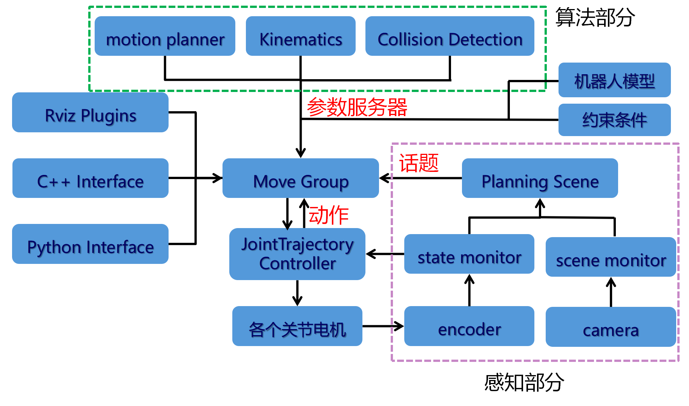

# Moveit架构学习

主要借助分析Moveit Setup-Assistant生成的功能包×××_moveit_config来理解Moveit的架构。
借助于Moveit Setup-Assistant生成的功能包×××_moveit_config的过程在[一个Moveit setup Assistant 设置示例(机械臂+夹爪)](https://blog.csdn.net/searcon/article/details/153875288?spm=1001.2014.3001.5501)中已经介绍，这里主要分析生成的功能包中的文件。

我们看一下功能包的组成，主要就是两部分，一部分是config文件夹下的文件，另一部分是launch文件夹下的文件。

- config文件夹下的文件: 主要是一些参数配置文件，例如关节约束、控制器配置、运动规划器配置、传感器配置等
- launch文件夹下的文件: 主要是一些启动文件，用于启动Moveit相关的节点和功能

## 一、move_group.launch文件分析

如果问launch文件中最主要、最核心的文件是哪一个? 答案肯定是move_group.launch，MoveIt的实现核心正是move_group节点的功能实现。
move_group加载了运动学求解器、路径规划器、碰撞检测等功能，同时可以接收来自外部的运动规划请求(rviz plugins、C++ Interface、Python Interface)，例如通过RViz的运动规划插件发送的运动规划请求。并且接收规划场景信息，例如我们添加的静态场景物体、传感器动态获取点云信息构建的障碍物等。
最终可以输出规划好的轨迹，借助于action通信交给控制器执行。


我们列举一个该文件的程序，如下：

```xml
<launch>

  <!-- GDB Debug Option -->
  <arg name="debug" default="false" />
  <arg unless="$(arg debug)" name="launch_prefix" value="" />
  <arg     if="$(arg debug)" name="launch_prefix"
           value="gdb -x $(find aubo_moveit_config)/launch/gdb_settings.gdb --ex run --args" />

  <!-- Verbose Mode Option -->
  <arg name="info" default="$(arg debug)" />
  <arg unless="$(arg info)" name="command_args" value="" />
  <arg     if="$(arg info)" name="command_args" value="--debug" />

  <!-- move_group settings -->
  <arg name="pipeline" default="ompl" />
  <arg name="allow_trajectory_execution" default="true"/>
  <arg name="fake_execution" default="false"/>
  <arg name="fake_execution_type" default="interpolate" />
  <arg name="max_safe_path_cost" default="1"/>
  <arg name="jiggle_fraction" default="0.05" />
  <arg name="publish_monitored_planning_scene" default="true"/>

  <arg name="capabilities" default=""/>
  <arg name="disable_capabilities" default=""/>
  <!-- load these non-default MoveGroup capabilities (space seperated) -->
  <!--
  <arg name="capabilities" value="
                a_package/AwsomeMotionPlanningCapability
                another_package/GraspPlanningPipeline
                " />
  -->

  <!-- inhibit these default MoveGroup capabilities (space seperated) -->
  <!--
  <arg name="disable_capabilities" value="
                move_group/MoveGroupKinematicsService
                move_group/ClearOctomapService
                " />
  -->

  <arg name="load_robot_description" default="true" />
  <!-- load URDF, SRDF and joint_limits configuration -->
  <include file="$(find aubo_moveit_config)/launch/planning_context.launch">
    <arg name="load_robot_description" value="$(arg load_robot_description)" />
  </include>

  <!-- Planning Functionality -->
  <include ns="move_group" file="$(find aubo_moveit_config)/launch/planning_pipeline.launch.xml">
    <arg name="pipeline" value="$(arg pipeline)" />
    <arg name="capabilities" value="$(arg capabilities)"/>
    <arg name="disable_capabilities" value="$(arg disable_capabilities)"/>
  </include>

  <!-- Trajectory Execution Functionality -->
  <include ns="move_group" file="$(find aubo_moveit_config)/launch/trajectory_execution.launch.xml" if="$(arg allow_trajectory_execution)">
    <arg name="moveit_manage_controllers" value="true" />
    <arg name="moveit_controller_manager" value="aubo_i5" unless="$(arg fake_execution)"/>
    <arg name="moveit_controller_manager" value="fake" if="$(arg fake_execution)"/>
    <arg name="fake_execution_type" value="$(arg fake_execution_type)" />
  </include>

  <!-- Sensors Functionality -->
  <include ns="move_group" file="$(find aubo_moveit_config)/launch/sensor_manager.launch.xml" if="$(arg allow_trajectory_execution)">
    <arg name="moveit_sensor_manager" value="aubo_i5" />
  </include>

  <!-- Start the actual move_group node/action server -->
  <node name="move_group" launch-prefix="$(arg launch_prefix)" pkg="moveit_ros_move_group" type="move_group" respawn="false" output="screen" args="$(arg command_args)">
    <!-- Set the display variable, in case OpenGL code is used internally -->
    <env name="DISPLAY" value="$(optenv DISPLAY :0)" />

    <param name="allow_trajectory_execution" value="$(arg allow_trajectory_execution)"/>
    <param name="max_safe_path_cost" value="$(arg max_safe_path_cost)"/>
    <param name="jiggle_fraction" value="$(arg jiggle_fraction)" />


    <!-- Publish the planning scene of the physical robot so that rviz plugin can know actual robot -->
    <param name="planning_scene_monitor/publish_planning_scene" value="$(arg publish_monitored_planning_scene)" />
    <param name="planning_scene_monitor/publish_geometry_updates" value="$(arg publish_monitored_planning_scene)" />
    <param name="planning_scene_monitor/publish_state_updates" value="$(arg publish_monitored_planning_scene)" />
    <param name="planning_scene_monitor/publish_transforms_updates" value="$(arg publish_monitored_planning_scene)" />
  </node>

</launch>
```

我们先不考虑调试debug、info等调试参数, 以及MoveGroup加载或禁用特定功能的参数(capabilities, disable_capabilities)。
主要设置的是以下参数(move_group节点配置参数)：

- **pipeline**：规划器库的名称
- **allow_trajectory_execution**：是否允许轨迹执行
- **fake_execution**：是否使用虚拟执行，不实际控制机器人（仿真、实际机器人） 直接接rviz。
- **fake_execution_type**：虚拟执行的类型（interpolate：插值执行，execute：直接执行）
- **max_safe_path_cost**：安全路径的最大成本
- **jiggle_fraction**：调整分数，用于处理微小碰撞
- **publish_monitored_planning_scene**：是否发布监控的规划场景

接下来分别会调用planning_context.launch(加载机器人模型、SRDF、关节限制配置), planning_pipeline.launch.xml(加载规划器库), trajectory_execution.launch.xml(加载轨迹控制器配置), sensor_manager.launch.xml(加载传感器配置)
最后启动move_group节点，传入前面设置的参数，并设置一些规划场景监控参数，例如是否发布规划场景、几何更新、状态更新等。

### planning_context

1. 加载机器人模型到参数服务器(robot_description)
2. 加载SRDF(默认位置、关节碰撞关系、规划组)到参数服务器
3. 加载关节、笛卡尔空间限制配置到参数服务器(joint_limits、cartesian_limits)
4. 加载关节组运动学求解器参数到参数服务器(kinematics)

### planning_pipeline

1. 根据pipeline参数选择规划器库(ompl、chomp、stomp等)
2. 加载规划器库的配置参数到参数服务器(config/ompl_planning.yaml)

### trajectory_execution

主要加载轨迹控制器的相关参数到参数服务器(trajectory_execution.yaml)，同时也会设置一些轨迹执行相关的参数，例如是否管理控制器、控制器管理器、虚拟执行类型等。

### sensor_manager

主要加载传感器配置到参数服务器(sensor_manager.yaml)，加载传感器插件到参数服务器(plugins)。

最后启动move_group节点，传入前面设置的参数，并设置一些规划场景监控参数，例如是否发布规划场景、几何更新、状态更新等。

## 二、其他配置

那如果我们想使用上面所提到的文件配置，去控制仿真(gazebo)中的机械臂或者说去控制实际机器人中的机械臂，我们需要做哪些修改？还需要写一些什么程序？
