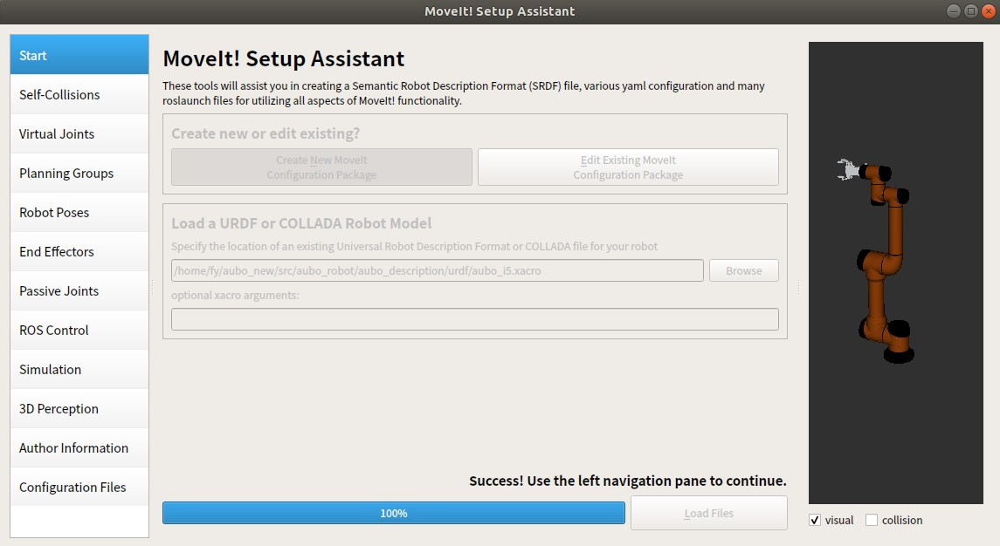
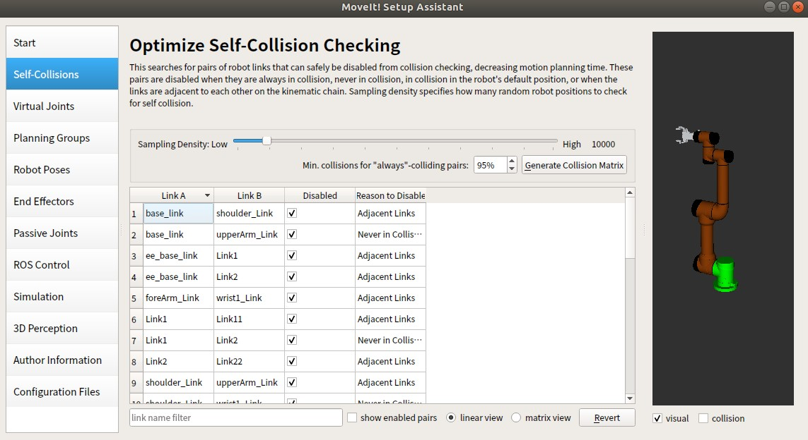
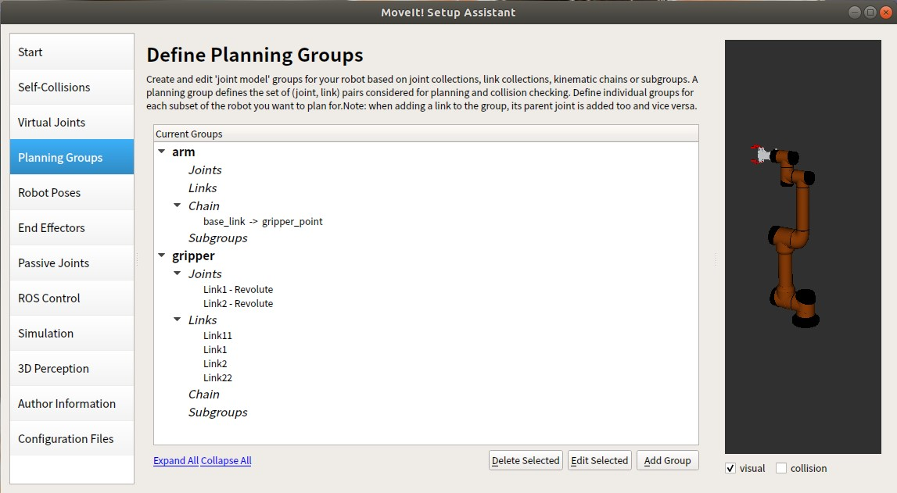
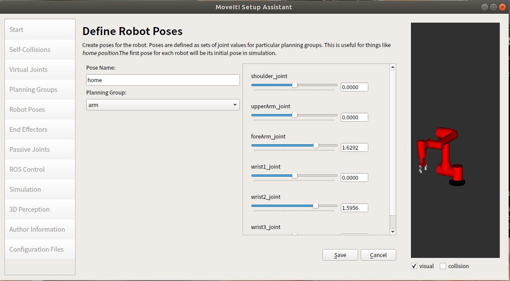
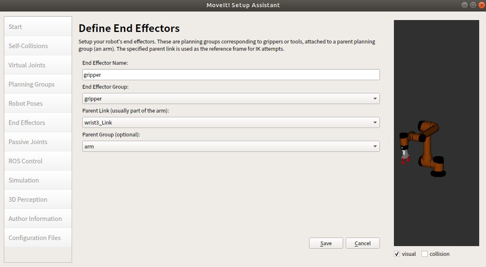
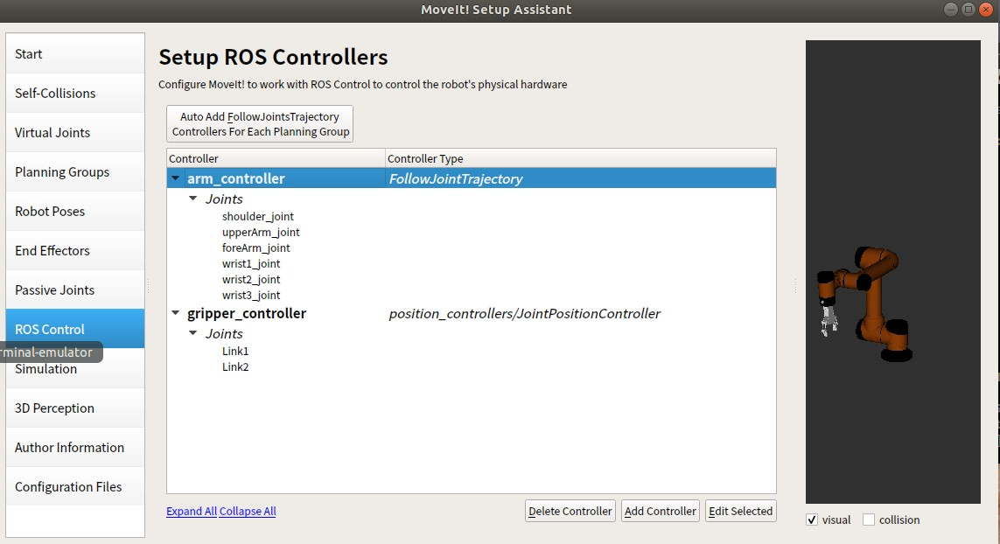
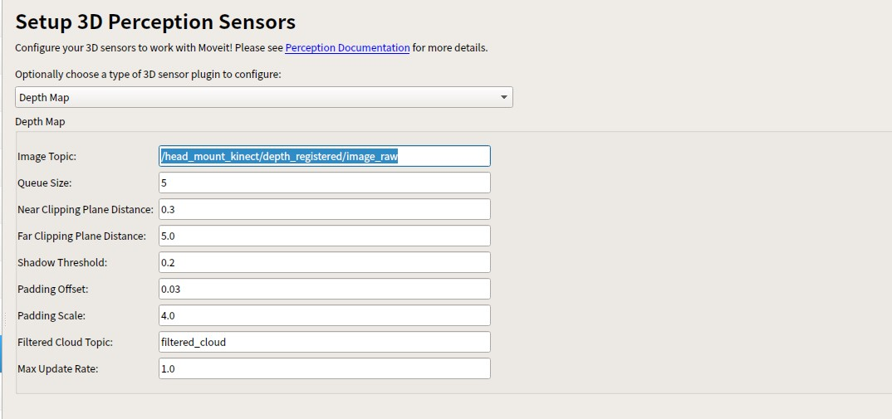
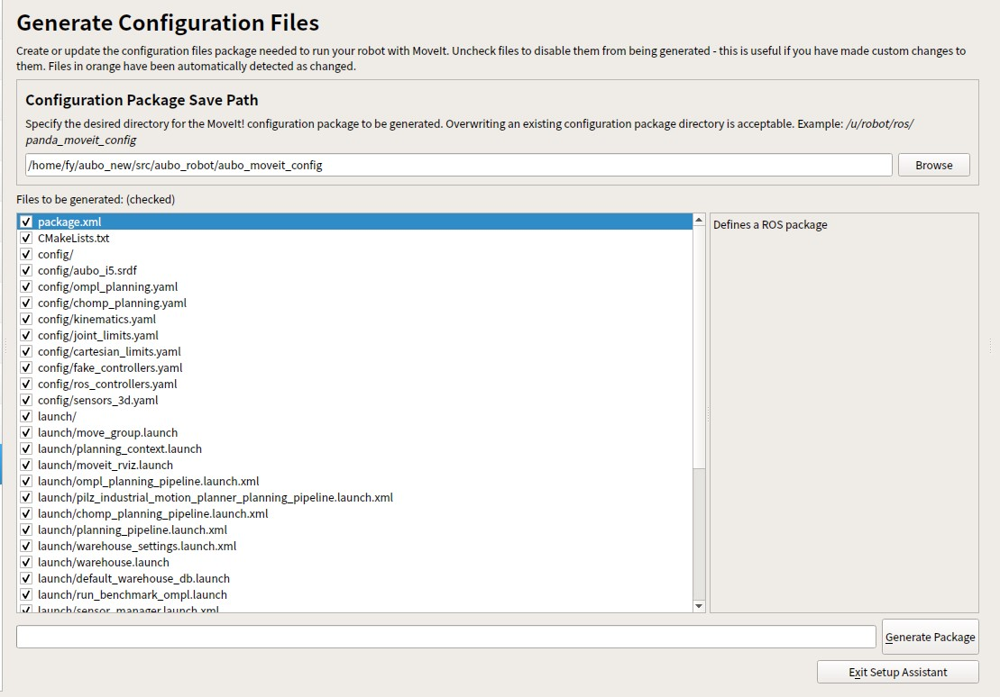

# 一个Moveit setup Assistant 设置示例(机械臂+夹爪)

说实在，看了很多教程还是古月老师的最详细，把他记录下来，忘了的时候回来看看。但是这个教程是kinetic版本的，对于melodic版本还需要一步设置控制器的步骤。下面就以melodic版本为例，记录一下。

## 一、启动setup assistant

在启动之前，最好先进入到urdf/xacro机器人模型文件的功能包中，更新一下环境变量，以免找不到模型文件。完成后，在终端中启动moveit_setup_assistant. 使用指令`rosrun moveit_setup_assistant moveit_setup_assistant`,启动配置界面。

## 二、导入模型文件

可以导入模型文件（机器人的URDF\xacro文件），也可以对之前Setup Assistant生成的功能包进行修改（功能包路径）
我们选择**Create New Moveit Configuration Package** ，导入机器人模型文件创建新的功能包
选择我们的模型导入即可，如果导入失败，检查一下模型文件是否正确（可以通过将模型文件加载到参数服务器中，借助于rviz查看）

界面的右侧就是我们导入成功的机械臂模型。

## 三、自碰撞检测（self-Collisions）

自碰撞检测（self-Collisions）是指在规划运动路径时，避免机械臂的关节之间发生碰撞。通过采样的方式生成我们的碰撞矩阵（我们可以拖动滑轨调整采样次数，1万次基本够用）碰撞矩阵会记录哪些连杆会发生碰撞，哪些连杆永远不会发生碰撞，减轻碰撞检测的计算代价。

## 四、虚拟关节（Virtual Joints）

机械臂一般是固定在一个地方的，所以是不需要的。对于移动的部件，例如机器臂是要固定到移动地盘上，那么轮子对应的旋转关节是要作为虚拟关节添加上的。

## 五、规划组（Planning Groups）

规划组是指将机械臂的关节和末端执行器进行分组，以便于进行运动规划和控制。我们可以创建多个规划组，例如机械臂的关节组、夹爪组等。
**机械臂各个关节组成的规划组的配置：**

设置规划组名称、运动学求解器、搜索分辨率、时间（这里使用KDL求解器，时间设置为0.05，其余默认）

运动学求解链指定起始机器人的末端（例如base_link）和 机械臂最末端（我们希望的机械臂做规划的时，最末端的那个点 可以通过设置一个link来指定）这里使用base_link gripper_point

**夹爪规划组的配置：**
因为夹爪往往只有一个自由度，并不需要运动规划，直接指定开合角度\宽度即可，不设置求解器即可。选定对应的关节和对应的连杆即可。
例如我们这里的夹爪是两指的开合，我们可以加载一个关节位置控制器，所以并不需要运动规划，直接给定期望角度即可。
因此参数都默认，只需要制定规划组的名称、关节和连杆即可。

## 六、机器人位置（Robot Poses）

设置几个机器人的常用位置，方便机器人直接移动过去。拖用右侧对应关节的滑动条改变各个关节角度，设置对应机器人姿态。

## 七、末端执行器（End Effectors）

添加终端的夹爪：设置名称，选择5中设置的夹爪的规划组，在那个坐标系下描述的（Parent Link）选择自身坐标系

## 八、消极关节（Passive Joints）

和做运动学求解没有关系的关节，如果希望某个关节是不动的，则将该关节设置为消极关节。这里我们不设置任何消极关节。

## 九、控制器（ROS Controller）

这里我们需要添加控制器，否则Moveit无法控制机械臂运动。
这里主要是两种控制器，一个是**机械臂的各个关节控制组的控制器**，另一个是**夹爪的控制器**。
我们先添加**机械臂各关节控制器**：
因为预期的目标是借助于Moveit的运动规划功能，使得我们的机械臂可以自主规划避障，因此规划组得到的是一条机械臂各个关节执行的轨迹，因此底层需要的是一个关节轨迹控制器（Joint Trajectory Controller）来控制各个关节电机模拟轨迹。
而这里并不是配置关节轨迹控制器，而是配置一个action客户端控制器，用于将规划组得到的轨迹发送给关节轨迹控制器（作为action的客户端），因此这里选择的是FollowJointTrajectory控制器。
其实在setup assistant生成完功能包后，我们后续还需要对里面进行修改，比如要保证action的通信上命名空间、名称需一致。
我们添加**夹爪控制器**：
因为夹爪只有一个自由度，我们可以加载一个关节位置控制器（Joint Position Controller），用于控制夹爪的开合。

## 十、仿真（Simulation with Gazebo）

如果我们要进行仿真的话，需要将模型加载到Gazebo中。但是之前的模型文件中还缺少一些定义，例如驱动器和控制器。而这一步直接生成了仿真所需的模型文件（包含驱动器和控制器）。可以将其存起来，后续gazebo仿真实验, 用该模型文件加载到参数服务器。

## 十一、传感器三维感知（Sensor 3D Perception）

我们可以将深度图像\点云等传感器的信息构建成规划场景，用于避障。
值得主要的是话题要对应上，否则无法接收到传感器信息。

## 十二、导出功能包

当然我们需要先设置个人信息姓名、邮箱（Author information）
然后选择功能包存储的路径（Configuration Files）
为方便辨识，也为了方便配置运动学求解器 设置功能包的名称为 ×××_moveit_config（例如aubo_moveit_config）

