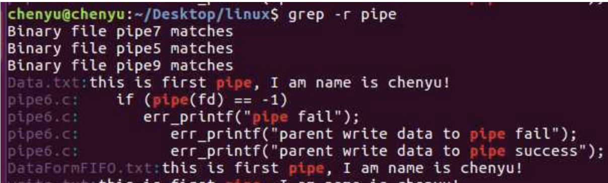

# 记录一些基本的指令

当忘记的时候可以回来看看

## 终端指令

当新建功能包后无法自动tab出后，需要使用roscd 寻找一次，然后就可以自动tab出
rosdep自动安装功能包依赖的其他包
~当前目录，~ 为/home/用户名 ， /根目录
cd ~/. cd cd ~/效果一样 . 句点代表此目录本身，一般可以不写。 运行./当前目录下文件。运行 ~/.X 是主目录下隐藏文件X。

### 删除
删除文件使用`rm -rf 目录名字` 命令即可

-r 就是向下递归，不管有多少级目录，一并删除
-f 就是直接强行删除，不作任何提示的意思

eg
**删除文件夹**实例：rm -rf /var/log/httpd/access
将会删除/var/log/httpd/access目录以及其下所有文件、文件夹
**删除文件**使用实例：rm -f /var/log/httpd/access.log
将会强制删除/var/log/httpd/access.log这个文件

## vim

- 输入i：修改插入
- 输入esc：退出
- 输入wq：保存退出
- 输入q!：不保存强制退出

## CPP

### 编译和头文件
编译：g++命令生成可执行文件Hello.exe `g++ -o Hello hello.cpp` 
头文件引用：<>与""区别 前者为系统路径，标准库。后者是当前路径自定义或第三方库

### main输入参数

说一下`main(int argc, char *argv[])`函数的两个形参`（char *argv[]`或者`char ** argv`形式，`char **argv[]`报错），第一个`int argc`，是记录你输入在命令行上的字符串个数；第二个argv[]是个指针数组，存放输入在命令行上的命令（字符串）。由于[ ] 的优先级高于* 所以a先和 [ ]结合，他还是一个数组，数组中的元素才是char *指针变量 ，前面讲到char * 是一个指针变量，保存的地址，保存的是数组中每个元素的地址。
main输入参数：

-argv[]是一个字符数组.
-argv[0]:指向程序的全路径名
-argv[1]:指向在DOS命令行中执行程序名后的第一个字符串。
-argv[2]:指向第二个字符串。

```cpp
#include <iostream>
using namespace std;

int main(int argc, char** argv)
{
	cout << "hello world" << endl;
	cout << argc << endl;
	if (argc > 1)	
	cout << argv[1] << endl;
	return 0;
}
```

对该程序进行编译


### 返回参数

返回值，除非明确声明不返回值。否则函数必须有一个返回值，main（）也是函数，且总返还整数，return 0成功运行 -1错误，比如void就无需返回。

sizeof():返回所占总空间的字节数

## Python

给py文件添加执行权限：`chmod +x XXX.py`

## 快速查找

快速搜索在目录下的含有关键字的文件,方便查找话题订阅发布关系。gre -r


## 数据类型

### time

ros::Time       时间
ros::Duration   持续时间
ros::Rate       频率

常用`ros::Time::now()`来实例化当前时间，例如`ros::Time begin = ros::Time::now()`
`bool ros::Duration::sleep()` ：为持续时间指定的睡眠时间，例如使用`ros::Duration(0.5).sleep();`
同时也可以使用频率

```cpp
ros::Rate r(10); // 10 hz
while (ros::ok())
{

//... do some work ...
    r.sleep();
}
```


